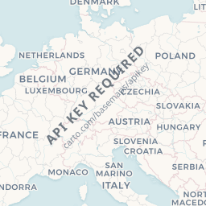
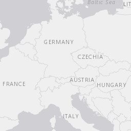
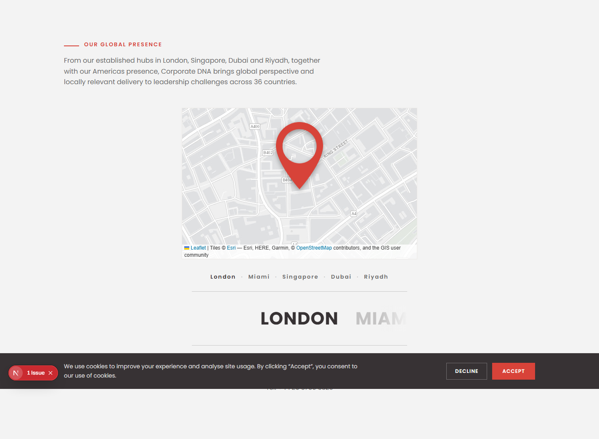

# Estado do Projeto — Corporate DNA (site institucional)

**Documento gerado em:** 2026-07-24
**Última atualização:** 2026-07-28 (mapa mergeado; refactor single-locale)
**Repositório:** `consulting-dna-corporate`
**Branch atual:** `refactor/single-locale-no-middleware` (single-locale EN, sem middleware — 6 commits à frente da `main`, aguardando merge)
**Branch principal:** `main`

> **Nota de atualização (2026-07-28):** o mapa interativo (`feat/map`, §5) já foi
> **mergeado na `main`** há tempos. Além disso, a i18n com prefixo (`/pt /es`) que
> chegou a ser entregue foi **revertida** — o site voltou a ser **single-locale
> (inglês) sem middleware**. Ver `CORRECOES-24-07-STATUS.md` para o detalhe da reversão.

Este documento consolida **tudo que foi feito até agora** no projeto: o site em si,
a integração com o CMS e a feature em andamento (mapa interativo). Serve como ponto
de referência único para retomar o trabalho.

---

## 1. O que é o projeto

Site institucional (marketing) da **Corporate DNA Consulting** — consultoria de
liderança executiva (CEOs, C-suite, sucessão, transformação cultural), com atuação
global e 5 escritórios (Londres, Miami, Singapura, Dubai, Arábia Saudita).

O produto maior descrito em `docs/proposta.txt` prevê uma plataforma de marketing
alimentada por um **CMS headless próprio**, construído pela Dev em Dobro. Este
repositório é **apenas o site público**; o CMS é um projeto separado (ver §4).

---

## 2. Stack técnica

| Camada | Tecnologia |
|--------|-----------|
| Framework | **Next.js ^16.2** (App Router) |
| UI | **React 19** |
| Estilo | **Tailwind CSS v4** (via `@tailwindcss/postcss`) |
| Animação | **GSAP 3.15** + `@gsap/react` |
| Mapa | **Leaflet 1.9** + tiles CARTO Voyager (keyless) |
| Validação | **Zod 4** |
| Linguagem | **TypeScript 5.9** |
| Deploy | **Vercel** (scope `impulse66` — ver memória de deploy) |

Scripts (`package.json`): `dev` e `start` rodam na porta **3006**.

---

## 3. Estrutura e histórico do site

O site foi construído e polido ao longo de várias iterações (ver `git log`). Marcos
principais, do mais antigo ao mais recente:

- **Design v1/v2/v3** — exploração de layouts; v1 foi consolidado como o design final
  (v3 removido, homepage passou a ser a raiz do site com `/v1` redirecionando).
- **Homepage revamp** — hero, nav e footer redesenhados, formulário de contato, marquee
  de logos de clientes (Aramco, Alphabet, Microsoft, etc.), seção do livro
  ("Leadership: it's in your DNA"), metodologia 5H, contadores de estatísticas.
- **Seção de pessoas (liderança)** — cards clicáveis com modal de perfil detalhado.
- **Integração com CMS** — conteúdo deixou de ser hardcoded e passou a ser lido da API
  do CMS (ver §4).
- **Polimento de conteúdo do CMS** — strip de HTML, hero banner de solução, campos de
  case, correções de richtext.

### Layout principal
`app/page.tsx` é a homepage (raiz). Compõe: `NavV1`, `HeroV1`, `LogoMarquee`,
seções de desafios/diferenciais/5H, `Counter` (stats), `PeopleGrid` (via CMS),
cases, livro, `ContactForm`, **`LocationsBlock`** (mapa — feature nova) e `SiteFooter`.

---

## 4. Ecossistema de specs (`specs/`)

O projeto segue um fluxo de specs numeradas (Spec-Kit). Há três features:

### `001-custom-cms` — CMS headless (projeto SEPARADO)
- **Status:** Draft (especificação).
- Restrição forte do cliente: o CMS **deve ser um projeto separado do site** —
  codebase, deploy e domínio próprios. Este repositório apenas **consome** conteúdo.
- Documentação completa: `spec.md`, `plan.md`, `data-model.md`, `research.md`,
  `quickstart.md`, `tasks.md` + contratos de API (`admin-api.md`, `read-api.md`).

### `002-site-cms-integration` — integração site ↔ CMS (lado do site)
- **Status:** **Implementado** (US1 + US2 entregues em 2026-07-22; build verde, 30 rotas;
  verificado ao vivo contra o CMS em `:3010`).
- O site consome a **API HTTP de leitura** do CMS (não o banco direto). Substituiu
  conteúdo hardcoded (perfis de liderança, solutions/5H/cases/regiões/livro/awards/insights)
  por conteúdo publicado vindo do CMS.
- Teste de smoke opcional (Vitest, T027) foi adiado.
- Conexão via `.env.local` (banco/API já configurados).

### `003-interactive-locations-map` — mapa interativo (FEATURE ATUAL) ⬅
Detalhada na §5 abaixo.

---

## 5. Feature atual: Mapa interativo de escritórios (`feat/map`)

Substitui a antiga grade estática "Our offices" na homepage por um bloco
**mapa + carrossel** interativo.

### Comportamento
- Um mapa mostra o escritório ativo com um **pin** customizado.
- Abaixo, um **carrossel horizontal** com os nomes das cidades; a cidade central
  (ativa) fica em negrito/escura, as vizinhas ficam esmaecidas.
- Ao trocar de escritório, a câmera do mapa faz um **fly** (zoom out → viaja pelo
  mundo → zoom in) e o pin cai com um "bounce".
- **O mapa NÃO é interativo** pelo usuário (sem drag, scroll-zoom, double-click, etc.).
  Toda navegação é pelo carrossel: setas, clique numa cidade, swipe (mobile) ou teclado.
- Respeita `prefers-reduced-motion` (pulo instantâneo em vez do fly).
- **Degradação graciosa**: se o mapa falhar, cai para uma grade de escritórios legível.
- Carregamento **lazy** — o mapa só monta quando a seção entra na viewport (protege o LCP).

### Arquivos entregues
| Arquivo | Papel |
|---------|-------|
| `lib/offices.ts` | Fonte de verdade: tipo `Office` + os 5 escritórios (coords, zoom, endereço, tel, email). Define a ordem do carrossel. |
| `components/LocationsMap.tsx` | Wrapper imperativo do Leaflet: mapa 100% não-interativo, pin de marca, `flyTo`/jump, choreografia do pin (fade → fly → bounce), cleanup. |
| `components/LocationsCarousel.tsx` | Carrossel controlado: cidade ativa centralizada, vizinhas esmaecidas, setas/clique/swipe/teclado, `aria-current`, re-centra após carregar fonte e em resize. |
| `components/LocationsBlock.tsx` | Orquestrador: estado do índice ativo, mount lazy via IntersectionObserver, reduced-motion, bloco de endereço, swipe no mapa, fallback grid. |
| `app/page.tsx` | Seção estática antiga substituída por `<LocationsBlock />` (linha 314); array `offices` antigo removido. |
| `public/pin.png` | Imagem do pin customizado (112×160). |
| `mapa.JPG` | Design de referência (na raiz do repo). |

### Progresso das tasks (`tasks.md`)
- **T001–T008: concluídas** (setup, dados, os 3 componentes, integração, `tsc --noEmit` limpo).
- **T009: pendente** — passagem manual dos cenários 1–9 do `quickstart.md`.

---

## 6. ✅ Stack do mapa: Leaflet + Esri (a CARTO saiu em 30/08/2026)

> **Trocamos o provedor de tiles em 30/08/2026.** A CARTO deixou de ser keyless e passou a
> devolver os tiles **com "API KEY REQUIRED" carimbado dentro da imagem** — não era o nosso
> ambiente, era o servidor deles, e ia para produção assim. Saímos para **Esri World Light Gray**,
> que responde sem chave e sem carimbo. O histórico completo, com as evidências, está em §6.1.
> A parte "Leaflet, não Mapbox" abaixo continua valendo e nunca esteve em questão.

Historicamente a **spec/plan/tasks falavam em "Mapbox"** (com menção a MapLibre/OpenFreeMap
numa etapa intermediária), mas a **implementação real usa Leaflet + tiles raster**, que não
precisam de token. Essa divergência **já foi sanada no código**:

- **Sem bloqueio por token.** A antiga nota da task T009 ("blocked on a real
  `NEXT_PUBLIC_MAPBOX_TOKEN`") está **obsoleta** — com Leaflet+Esri o mapa renderiza
  sem token nenhum.
- **Comentários de código já limpos:** os componentes (`LocationsBlock.tsx`,
  `LocationsMap.tsx`, `LocationsCarousel.tsx`) e `lib/offices.ts` **não têm mais**
  referências a Mapbox/MapLibre/OpenFreeMap (verificado em 2026-07-28).
- **`package.json` confirma:** dependência é **`leaflet` ^1.9.4** + `@types/leaflet`;
  **não há** `mapbox-gl` nem `maplibre-gl` instalados.
- **Pendência residual (só docs de spec):** `specs/003-.../tasks.md` (T001/T002/T004)
  ainda cita `mapbox-gl`/`NEXT_PUBLIC_MAPBOX_TOKEN`, e T002 fala em "CARTO Voyager keyless".
  É documentação histórica; o código é a fonte de verdade. Corrigir se/quando alguém
  revisitar a spec 003.

### 6.1 Por que a CARTO saiu — e o que aprendemos

**O que era o problema.** O mapa não é uma imagem nossa: o Leaflet monta o fundo baixando
quadradinhos de imagem (*tiles*) do servidor de outra empresa, um por pedaço do mundo, conforme
você navega. A CARTO servia isso de graça e sem cadastro. **Ela mudou a política:** continuou
entregando os quadradinhos, mas com **"API KEY REQUIRED — carto.com/basemaps/apikey" escrito por
cima do mapa**, em diagonal, igual marca d'água de banco de imagem. Quem abrisse o site via a
frase atravessada em cima dos países — na home, em `/our-team` e em `/our-clients`.

**Não era o nosso ambiente, e isso foi verificado.** Baixando
`https://a.basemaps.cartocdn.com/rastertiles/voyager/4/8/5.png` direto por HTTP, com e sem
`Referer` do domínio do alpha, vinham **os mesmos 20.215 bytes**, já carimbados. Não havia
liberação por domínio: o carimbo é gravado no PNG pelo servidor deles. Estava visível no alpha,
que é o link que a CDNA e o Guli abrem.

| Antes (CARTO) | Depois (Esri) |
| :------------ | :------------ |
|  |  |

E no site, depois da troca:

**De quem era.** Nossa. Fomos nós que apontamos para a CARTO keyless. Por isso **não entrou** no
PDF nem no e-mail de status de 30/08: virar "decisão da CDNA antes do lançamento" seria devolver
ao cliente um problema que ele não criou e não tem como avaliar.

**Duas armadilhas da troca, ambas já tratadas em `components/LocationsMap.tsx`:**

1. **A ordem dos eixos da Esri é `{z}/{y}/{x}`**, invertida em relação à CARTO. Trocar errado
   devolve um tile válido do lugar errado — mapa torto, nunca erro.
2. **O cache da Esri para de valer no zoom 16**, embora o serviço anuncie níveis até 23. Acima
   disso ele devolve **HTTP 200** com um tile cinza escrito *"Map data not yet available"* — ou
   seja, o Leaflet não tem como detectar como falha, e o fallback de lista nunca dispararia.
   Resolvido com `maxNativeZoom: 16`, que faz o Leaflet ampliar o tile de nível 16 em vez de
   pedir um nível que voltaria em branco. Os escritórios estão todos em zoom 16 (`lib/offices.ts`),
   então hoje isso é só guarda para o futuro.

**Alternativas descartadas:** abrir conta na CARTO e usar chave (custa e amarra a conta a um
provedor), e o tile server padrão do OSM (a política deles desencoraja uso comercial).

---

## 7. Pendências / próximos passos

### 0. 🔴 O banco de conteúdo da CDNA está numa conta Supabase que ninguém identificou

**A pergunta, feita em 31/08/2026:** de quem é a conta Supabase que guarda o conteúdo da Corporate
DNA? **Não foi possível responder desta máquina.** E o fato de não ser possível já é o problema:
todo o conteúdo autorado — os 8 cases, as Solutions, as pessoas, as parcerias — vive num banco cujo
dono não está registrado em lugar nenhum.

**Onde procurei, e por que cada caminho falhou:**

| Caminho | Resultado |
| :------ | :-------- |
| Os dois repositórios | Nenhuma URL `*.supabase.co`. O `.env.example` do CMS só tem o placeholder `https://<project-ref>.supabase.co`; o `.env.local` aponta para o stack local (`127.0.0.1:54321`) |
| `docs/handover.md` do CMS | Descreve arquitetura, variáveis e o procedimento de `pg_dump` — **não diz de quem é a conta** |
| `vercel env pull` (produção, `dobro66/corporate-dna-cms`) | As variáveis existem, criadas há 39 dias, mas voltam **vazias**: são sensíveis, a Vercel não devolve o valor. Não é erro de configuração — o CMS em produção funciona e serve o alpha |
| Bundle do CMS publicado | A `NEXT_PUBLIC_SUPABASE_URL` só é usada no servidor (auth via `app/api/auth/*`), então o ref **não** é inlinado no JS do cliente. Varridos os 9 chunks do `/login`: nada |
| Cookies do `/login` | Nenhum cookie `sb-<ref>-auth-token` antes do login |
| CLI do Supabase | Não autenticado nesta máquina (`Access token not provided`) |

**Candidato eliminado — `devemdobro@gmail.com` NÃO é a conta.** Verificado em 31/08/2026 com
`npx supabase login` seguido de `orgs list` e `projects list`. A conta tem **uma única
organização**, "Dev em Dobro" (`mvbgdwfhcbwpzahxixzy`), com 13 projetos, e **nenhum é da Corporate
DNA**. Os únicos dois `ACTIVE_HEALTHY` são `ode-cms` e `ode-clube`, do outro cliente; o restante
está `INACTIVE`. Isso derruba a suposição óbvia — o banco da CDNA está numa conta que **esta**
não enxerga.

**Próximo passo, na ordem certa: achar o ref antes de caçar a conta.** Abrir o painel da Vercel em
`dobro66/corporate-dna-cms` → Settings → Environment Variables → revelar
`NEXT_PUBLIC_SUPABASE_URL`. O ref é o subdomínio (`https://<ref>.supabase.co`). Com o ref na mão,
a conta é simplesmente aquela que consegue abrir
`https://supabase.com/dashboard/project/<ref>`.

Vale tentar pelo painel mesmo o `vercel env pull` tendo voltado vazio: o pull devolveu vazio até
para variáveis banais como `SITE_URL` e `CMS_DISABLE_MFA`, o que parece limitação do CLI e não
marcação de sensível uma a uma. A interface provavelmente revela.

**Outras identidades que este projeto já usa**, e portanto candidatas a dona da conta:
`impulseaisolutions@gmail.com` (dono do Resend, `corporate-dna-cms/docs/deploy-prod.md:12`, e a
identidade exigida no autor do commit HEAD) e `gemeos@devemdobro.com` (que aceitou o convite do
Cloudflare em 13/08). Uma conta da própria CDNA também não está descartada.

**Anotar aqui o resultado quando souber:** o ref do projeto, o e-mail dono da conta, a organização,
e se a conta é nossa ou da CDNA.

### 0.1 🔴 E esse banco não tem backup automático

Ligado ao item acima, e mais urgente que ele. Registrado em `corporate-dna-cms`,
`specs/001-supabase-auth-migration/research.md`, risco **R2**, em 19/07/2026:

> "the project **IS on the Free tier** — no automated backups, no PITR. […] the scheduled `pg_dump`
> procedure in `docs/handover.md` is the only recovery path, and **someone must own running it from
> the first day real content exists**. Decide on Pro + PITR before the CMS carries anything anyone
> would miss."

Em 19/07 isso era teórico. **Hoje não é:** o CMS já carrega o conteúdo real que o alpha serve. O
plano gratuito da Supabase não faz backup nenhum, o `pg_dump` continua sem dono, e perder esse banco
significa redigitar tudo — as pessoas dá para reconvidar, o conteúdo não.

Duas decisões, e as duas são de negócio, não técnicas: **quem roda o dump e com que frequência**, e
**se sobe para o plano Pro com PITR antes do lançamento**. Ver `corporate-dna-cms/docs/handover.md`,
seção Backup & recovery, para o comando.

### Demais pendências

1. **Validar o mapa manualmente** (quickstart cenários 1–9): fly entre escritórios,
   pin, não-interatividade, swipe mobile, reduced-motion, fallback, responsivo (375px→desktop).
2. **Ajuste fino de `coords`/`zoom`** em `lib/offices.ts` — as coordenadas são
   aproximadas; refinar visualmente cada escritório.
3. ~~**Sincronizar documentação** com a stack real (Leaflet/CARTO)~~ ✅ **Feito**
   (2026-07-28) — comentários de código limpos e §6 atualizada. Resta só a spec 003
   histórica (`tasks.md`), opcional.
4. ~~**Commit + PR** da branch `feat/map`~~ ✅ **Mergeado na `main`** há tempos.
5. **Merge do refactor single-locale** — a branch `refactor/single-locale-no-middleware`
   está 6 commits à frente da `main` aguardando PR/merge.
6. **Deploy:** somente quando o usuário pedir explicitamente; HEAD deve ter autor
   `impulseaisolutions@gmail.com` (scope `impulse66`), conforme regras de deploy.

---

## 8. Notas de deploy (memória do projeto)

- Deploy **apenas quando solicitado** — nunca automático.
- Deploy para a Impulse (scope `impulse66`); o autor do commit HEAD **deve** ser
  `impulseaisolutions@gmail.com` ou o time bloqueia.
- Existem dois logins Vercel (Impulse vs pessoal); cada um só enxerga o próprio scope.
