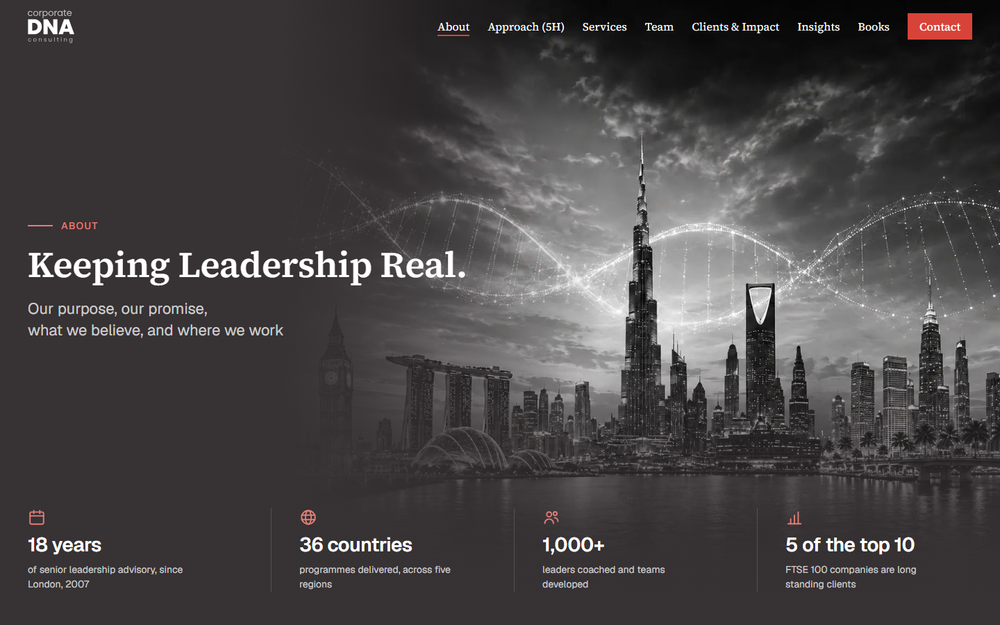
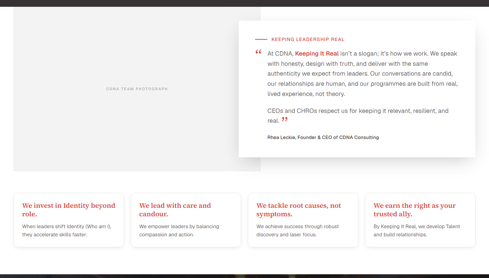
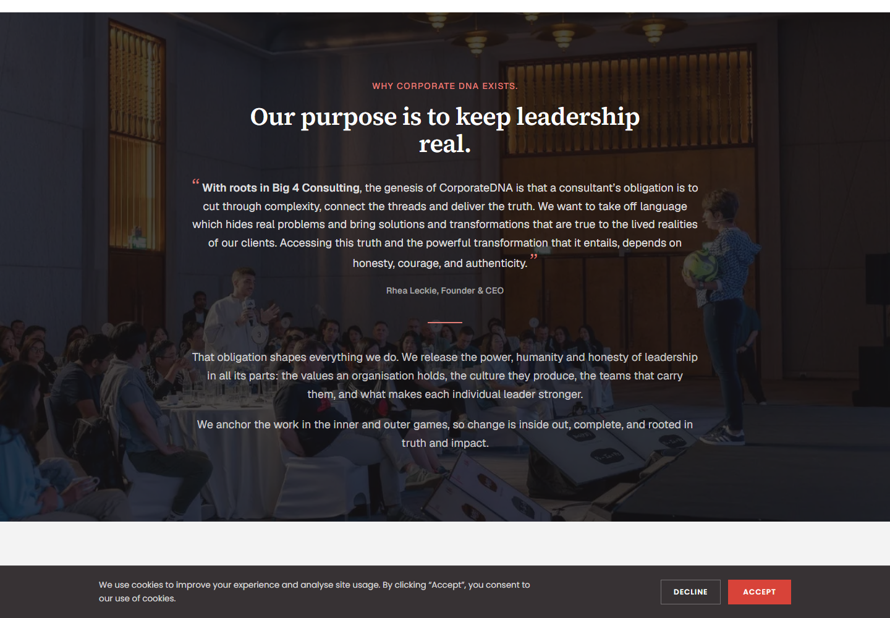
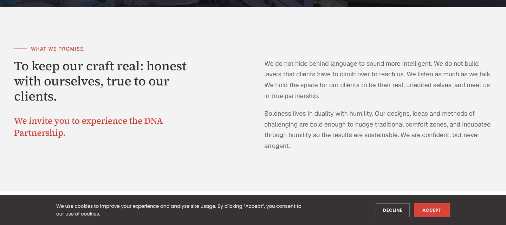
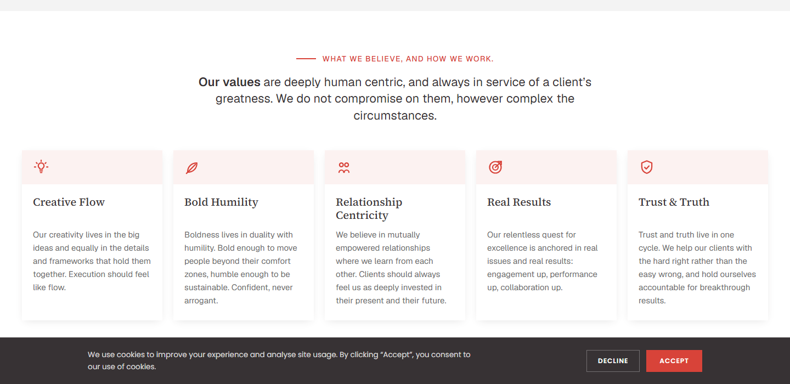
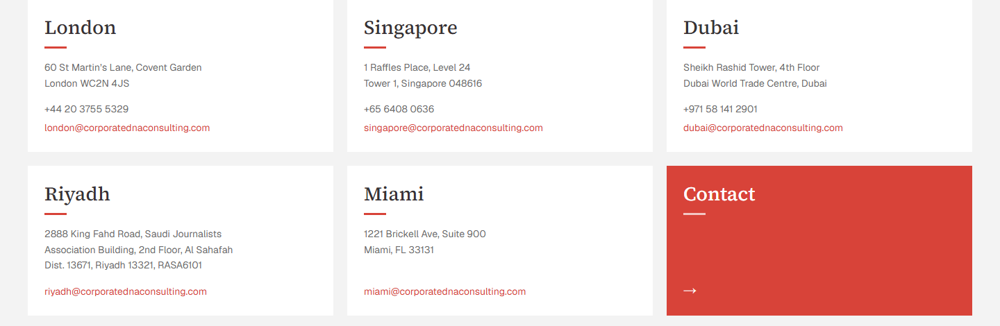
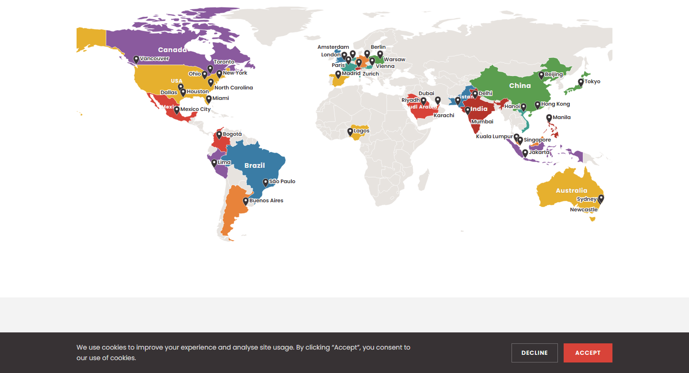
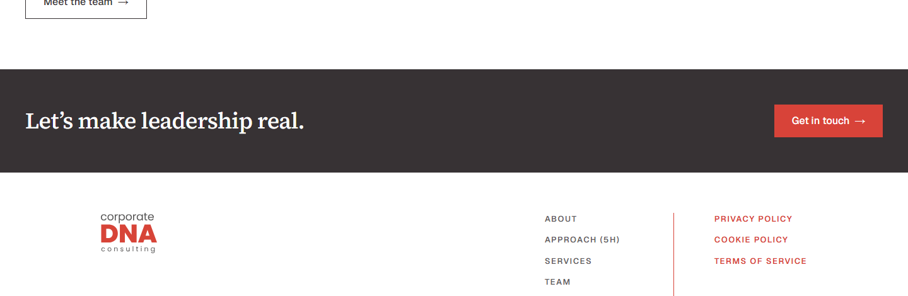

# About — revisão de design, seção por seção

**Para:** Guli
**De:** Ricardo
**Data:** 09/09/2026
**Página no ar para revisar:** `consulting-dna-corporate-alpha.vercel.app/about-v2`

> ⚠️ **A página está sendo mexida enquanto você lê.** As capturas abaixo são do estado de
> 09/09, fim de tarde. O que muda mais rápido é a tipografia (seção 0). Se algo na tela não
> bater com a imagem daqui, a tela está certa.

---

## Como responder

Cada seção abaixo tem três partes: **de onde veio**, **o que decidimos sem você** e **o que
está aberto**. Só a terceira precisa de você.

Responde do jeito que for mais rápido — escrever "ok" ao lado de cada uma já resolve. Onde não
for ok, o que ajuda é *o que* está errado, não a solução: a gente aplica.

| Seção | OK? | Observação |
|---|---|---|
| 0. Decisões da página inteira | | |
| 1. Hero | | |
| 2. Our Identity | | |
| 3. Our Purpose | | |
| 4. Our Promise | | |
| 5. Our Values | | |
| 6. Our Regions | | |
| 7. The people behind it | | |
| 8. Fecho | | |

---

## Por que esta página não passou pelo seu Figma

O modelo combinado em 28/08 é: você propõe no Figma, aprova com a CDNA, e só então a gente
aplica. Esta página fugiu disso, e não por atalho nosso.

Em 08/09 a Maliha mandou dois anexos: um documento de estrutura, bloco a bloco, com cada campo
marcado FINAL ou HOLD, e uma imagem de página inteira com a ordem dos blocos. Ou seja: **o
cliente desenhou a About**. O que a gente fez foi montar aquilo na linguagem visual que já
existe no site.

Onde o documento e a imagem discordam, seguimos o documento — ele é a instrução escrita para
desenvolvimento; a imagem vem com header branco, cards arredondados e ícones que não são deste
site, então serve de referência de **arranjo**, não de estilo.

É por isso que este documento existe: as decisões visuais abaixo foram tomadas na marra, no
código, para a página existir. Nenhuma delas está casada.

---

## 0. Decisões que valem para a página inteira

Estas são as maiores, e as que mais interessa você olhar primeiro.

### Tipografia — Geist + Source Serif 4, no lugar da Poppins

O problema, na palavra da Rhea: a Poppins é **"quadrada demais"**. Ela é geométrica — o `o` é
um círculo, o `a` não tem cauda — e no peso 700, que esta página usava em todo título, isso lê
como bloco.

A referência que ela aprovou (Explore Performance) faz o oposto: título em grotesca de peso
**médio**, corpo em **serifa**. O contraste entre os dois é o que dá ar editorial em vez de ar
de apresentação corporativa.

- **Geist** para títulos, rótulos, números e botões.
- **Source Serif 4** para corpo e legendas. A Explore usa freight-text-pro, que é da Adobe; a
  Source Serif é o equivalente livre mais próximo em desenho e altura de x.

As duas são carregadas **só nesta rota**, não no layout — nenhuma página real baixa duas
famílias por causa de uma proposta.

**Aberto:** o par inteiro. É a decisão de maior alcance da página e a que menos passou por
alguém de design. Se você discordar, é melhor agora, antes de virar padrão do site.

### Largura — 1440px, contra os 1200px do resto do site

O conteúdo desta página corre em 1440. As outras continuam em 1200, e a barra vermelha que
está em produção também.

**Consequência que você vai ver:** nas outras páginas a relação fica invertida por enquanto.
Some quando o resto migrar — mas migrar o resto é uma decisão, não uma consequência.

**Aberto:** 1440 ou volta para 1200.

### Menu — transparente e flutuando sobre o hero

Aqui o menu é a NavV2: `absolute`, transparente, sobre a imagem do hero, com o Contact como
único botão preenchido. A barra vermelha `sticky` do resto do site não aparece.

⚠️ **O outline da Maliha pede `sticky`.** Isso é divergência aberta com o cliente, não decisão
fechada.

### Alternância de fundos

`ink` → `white` → `ink com foto` → `paper` → `white` → `white` → `paper` → `white` → `ink`.

**Aberto:** a sequência tem dois `white` seguidos no meio (Values e o cabeçalho de Regions).
Funciona porque a segunda é curta, mas é o ponto mais frágil do ritmo.

---

## 1. Hero

**De onde veio:** outline, Block 1. Eyebrow, headline e standfirst são FINAL — texto do cliente,
palavra por palavra. Os quatro números também, com uma ressalva: o `36` aparece como `[36]`
entre colchetes no documento, pendente de confirmação.

**O que decidimos sem você:**
- A arte é a que a Maliha mandou em 08/09 (`public/about-hero.jpeg`), sem tratamento.
- Os quatro ícones dos números foram **desenhados à mão em SVG**, dentro do arquivo. O site não
  tem biblioteca de ícones, e instalar uma por causa de quatro desenhos numa rota que pode ser
  descartada não pagava. Contorno de 1,75 num quadro de 24, canto arredondado.
- Dois dos quatro "números" são frases inteiras ("5 of the top 10"), então eles não vão no
  tamanho da grade — a coluna não comporta.

**Aberto:** os ícones. Se a página for aprovada e eles aparecerem também nos cinco valores, aí
vale a conversa sobre adotar um conjunto de verdade.

---

## 2. Our Identity

**De onde veio:** outline, Block 2 — *"Two column. Photograph left, quote right. Four pillar
cards in a row beneath, full width."* A citação e os quatro pilares são FINAL.

O bloco reproduz um slide já aprovado internamente pela CDNA ("the approved Our Identity
slide").

**O que decidimos sem você:**
- **A foto não sangra.** Em 08/09 ela ia até a borda da janela, copiando a referência Explore
  que a Rhea aprovou. Em 09/09 o cliente pediu o contrário, e agora ela fica contida no mesmo
  1440 de todo o resto — borda esquerda na mesma linha do logo, do título e dos números.
- **Proporção travada em 3:2.** O outline pede *"landscape crop, no treatment"*. Antes a altura
  vinha do texto ao lado, então a proporção mudava com a largura da tela.
- Fundo branco, e não `bg-ink` escuro como o outline descreve.

**⚠️ A foto do time não existe.** O outline diz que ela foi entregue junto com o slide; nunca
chegou até nós. Pedida em 09/09. O cinza que você vê é placeholder no tamanho e na proporção
reais.

**Os quatro pilares seguem especificação escrita do cliente**, recebida em 09/09: *"White cards,
rounded corners, red bold heading, charcoal body. Equal height, four across on desktop, two by
two on tablet, stacked on mobile."* Verificado nas quatro larguras.

Duas coisas que essa spec desfaz, e as duas vinham do lado deles: os cards **eram pretos a
pedido da Rhea**, que quis de volta o device do site antigo; e **canto arredondado contraria o
sistema** — estes quatro são os únicos cantos redondos da página. Não é discussão nossa, mas
alguém vai perguntar.

O "bold" saiu em **600, não 700**: a Source Serif carrega 400/500/600 aqui, e pedir 700 faria o
navegador engordar o 600 sozinho. Negrito sintético em serifa borra o contraste entre haste fina
e grossa, que é o que define a família.

**Aberto:** o card branco da citação com sombra — esse é tratamento nosso, não está no outline
nem na imagem dela. E, em 1024px, três dos quatro títulos de pilar quebram em três linhas: as
alturas continuam iguais, mas é o ponto mais apertado da spec.

---

## 3. Our Purpose

**De onde veio:** outline, Block 3. *"Single column, centred, generous margins."* Todo o texto é
FINAL, incluindo a citação da Rhea sobre a origem no Big 4.

**O que decidimos sem você:** a foto de fundo e a régua vermelha que separa a citação do corpo.

**O painel de vidro saiu em 09/09.** O texto ficava dentro de um retângulo escuro translúcido
sobre a foto; o cliente pediu o texto direto na imagem. Medido depois de tirar: título branco a
**10,46:1** no pior ponto e 15,80:1 na média — passa AAA. O rótulo vermelho fica em **4,08:1**,
abaixo dos 4,5:1 que AA pede para texto e acima dos 3:1 de elemento gráfico. Esse é o teto da
cor, não consequência da remoção: `brand-light` contra branco puro dá 4,39:1 no máximo absoluto.

**Aberto:** a escolha da foto de fundo. É a única seção da página onde uma imagem carrega peso
e não é a imagem que o cliente mandou.

---

## 4. Our Promise

**De onde veio:** outline, Block 4. Texto FINAL.

**Declaração à esquerda, prosa à direita** — escolhido em 09/09 entre três versões montadas e
comparadas na tela. As outras duas eram texto empilhado, variando só medida e posição, e ficaram
guardadas.

Das sete seções, seis empilham texto. Esta é a única com estrutura lado a lado, e é a candidata
natural porque o conteúdo já vem partido em dois: uma promessa e a explicação dela. O convite
vermelho sobe para junto da declaração — promessa e convite são as duas frases que a CDNA diz na
primeira pessoa; a prosa da direita explica as duas.

**⚠️ Tensão com o outline, e ela é real.** O documento pede *"single column prose"*; a imagem da
Maliha mostra duas colunas. Nosso argumento: a **prosa** continua em coluna única — o que o
documento rejeita é partir o corpo do texto em duas, e não é o que acontece aqui. É argumento,
não certeza.

**Aberto:** se você achar que o argumento não se sustenta, as versões empilhadas voltam em um
comando.

---

## 5. Our Values

**De onde veio:** outline, Block 5. Os cinco corpos são FINAL.

**⚠️ Pendência de conteúdo:** o documento diz que **três dos cinco nomes** estão em HOLD, entre
colchetes, pendentes de confirmação — mas não diz quais três. Estão montados como campos de CMS
para trocar sem deploy.

**O que decidimos sem você, em 09/09:** os cinco viraram cards com **faixa de topo em vermelho a
7%**, com o ícone dentro dela, sombra suave e canto vivo. A ideia veio de uma referência de card
que o Ricardo mandou; o canto arredondado dela **não** veio junto, pelo motivo de sempre.

Saiu a régua vermelha à esquerda: com a faixa no topo ela seria a segunda marca vermelha do
mesmo card. Antes disso esta faixa tinha **onze elementos vermelhos** — cinco ícones, cinco
réguas e o rótulo. Agora tem seis.

Os títulos reservam duas linhas (`min-h-[2.4em]`) para os cinco corpos começarem na mesma
altura — "Relationship Centricity" quebra em duas e empurrava o texto dele 24px abaixo dos
vizinhos.

**Aberto:** a grade de cinco. Cinco colunas numa linha só é apertado; os títulos são frases
inteiras, não palavras soltas. Já corrigido o pior caso: cinco colunas só a partir de 1280px —
entre 1024 e 1279 são três, senão cada card ficava com 173px.

---

## 6. Our Regions

**De onde veio:** outline, Block 6. Cabeçalho e intro FINAL. Cinco escritórios com endereço,
telefone e e-mail regional — dado do cliente.

**Instrução explícita do outline, que seguimos:** o mapa aqui é **nível região, sem pins por
cliente**. Detalhe por cliente pertence a Clients & Impact.

**O que decidimos sem você:** os tiles de região com borda vermelha no topo, e o card vermelho
sólido de contato no meio da grade de escritórios — é o único elemento acionável de uma faixa
de cards brancos, então contorno ali não distinguiria nada.

**⚠️ Contradição dentro do próprio outline — dois telefones faltando.** A linha de instrução diz
*"OFFICES: **three cards**, each with address, telephone and regional email"*, e logo abaixo o
documento lista **cinco** cidades. Os telefones que ele fornece são exatamente três: London,
Singapore e Dubai. Riyadh e Miami não têm telefone em lugar nenhum do arquivo.

Não dá para ler como "são só três escritórios": a intro do bloco, que é FINAL, diz *"With
headquarters in London, Singapore, Dubai, Riyadh and Miami"*. São cinco, e faltam dois números.

**É por isso que os cards ficam desiguais** — Riyadh e Miami têm um campo a menos que os
vizinhos. Não é problema de grade, é dado faltando. Sabendo disso, a pergunta para você deixa de
ser "como equilibrar" e passa a ser se vale desenhar para tolerar campo ausente, já que o CMS
vai permitir isso sempre.

**⚠️ Pendência de conteúdo:** os descritores das cinco regiões estão em HOLD (máx. 120
caracteres cada). O texto que está lá é o que aparece na própria imagem da Maliha — placeholder
do cliente, não copy nossa.

**Aberto:** o tile vermelho de contato. Rótulo no topo, seta na base, e um vão no meio, ao lado
de cinco cards cheios de informação — consequência de ele acompanhar a altura dos vizinhos. O
vermelho já diz que é um tile de outra natureza; a questão é se o vão ajuda ou atrapalha.

**Divergência já resolvida:** a imagem mostra foto em cada tile; os campos de CMS do documento
são só `{ name, descriptor }`, sem imagem. Seguimos o documento.

---

## 7. The people behind it

**De onde veio:** pedido da Maliha em **09/09**, apontando o bloco que já existe na
`/our-identity` no ar. Copy idêntica — trazer aquele bloco, não desenhar um novo.

É também a resposta à pergunta dela sobre ligar a foto do time a uma galeria: em vez de a
fotografia do bloco 2 navegar em silêncio, a rota fica aqui, rotulada, no fim da leitura.

**O que decidimos sem você:**
- **Antes da faixa de fecho, não depois.** O pedido foi "última seção"; última seção de
  *conteúdo* é o que faz sentido. Dois botões em sequência — "Meet the team" e "Get in touch" —
  disputam o mesmo clique.
- **Botão de contorno**, não sólido. O sólido vermelho é da faixa logo abaixo, que é a ação
  principal.
- **Fundo branco**, e não `paper` como no original: o bloco anterior já é `paper`, e dois
  seguidos viram uma faixa só.
- **Alinhado à esquerda em 1440**, e não na coluna centrada de 820px do original.

**Aberto — e é o ponto mais fraco da página:** a metade direita fica vazia. Numa tela de 1440 o
texto ocupa 680px e sobra o resto. Alternativas: centrar a coluna (como no original), ou jogar
o botão para a margem direita — mas isso repete a estrutura da faixa logo abaixo.

---

## 8. Fecho

**De onde veio:** a imagem da Maliha. Assinatura, frase e um botão.

**⚠️ Aqui o documento e a imagem descrevem coisas diferentes, e o documento está incompleto.**
O outline diz "seven blocks" e descreve seis. Do sétimo sobrou só a linha de campos:
`repeatable link_card { heading, body, cta_label, cta_url }` — cards de navegação, sem título e
sem texto. A imagem mostra a faixa de fecho. Não é um contra o outro: são duas coisas
diferentes, e uma delas não veio inteira.

Montamos a versão da imagem porque era a única completa. Os `link_card` ficam de fora até o
texto chegar.

**Aberto:** quando o texto do bloco 7 chegar, os cards entram **junto** com a faixa ou **no
lugar** dela.

---

## O que trava a página, e não é design

Para você não gastar tempo achando que é problema visual:

| O quê | Estado |
|---|---|
| Foto do time (bloco 2) | Pedida em 09/09. É a única coisa entre esta página e "pronta". |
| Telefone de Riyadh e Miami | Não existem no documento. Ver abaixo — é erro do outline, não nosso. |
| Descritores das cinco regiões | HOLD no outline, máx. 120 caracteres cada. |
| Três dos cinco nomes de valores | HOLD, e o documento não diz quais três. |
| Corpo do bloco 7 | Nunca chegou. Só a lista de campos. |
| O `36` de "36 countries" | Entre colchetes no documento, pendente de confirmação. |

---

## Duas coisas que vão aparecer e não são desta página

**As rotas.** O mesmo documento pede renomear todas as rotas do site — `/about`, `/services`,
`/team`, `/clients-impact`, `/contact`, `/books` — com 301 das atuais. Isso contradiz o menu que
subiu em produção em 08/09, onde a decisão foi trocar só os rótulos e manter as rotas. Não está
resolvido, e não é trabalho de design.

**Dez serviços, não oito.** O outline de Services que chegou em 09/09 traz os oito que estão no
ar mais *Judgement in AI* e *Family Business Consulting*. São duas páginas novas. O cliente ainda
não foi avisado de que a gente notou.
